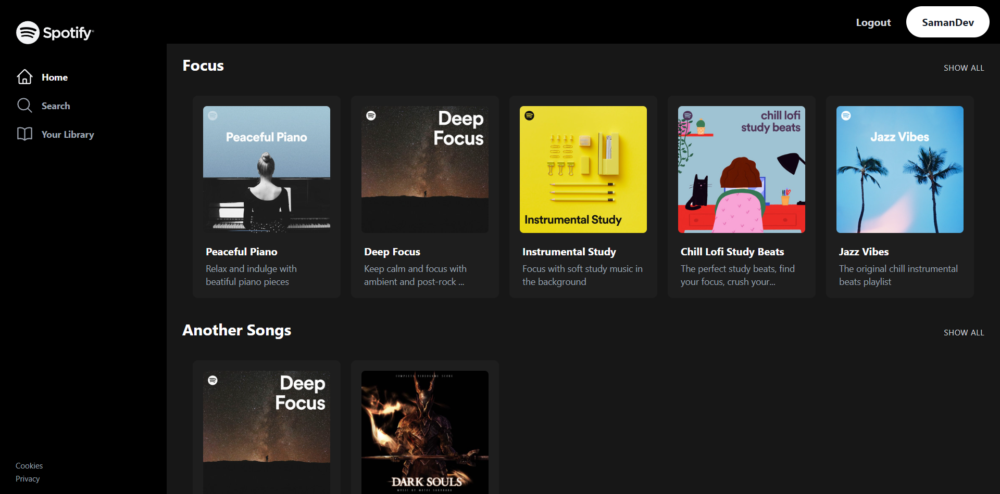

# Getting Started with R-Spotify
This Project requires **Node.js** installed on your system.

```shell
$ git clone https://github.com/Saman-Safaei/r-spotify.git
$ cd r-spotify
```
#### with NPM
```shell
$ npm install
$ npx msw init ./public
$ npm start
```
#### with Yarn
```shell
$ yarn install
$ yarn msw init ./public
$ yarn start
```

With this commands the R-Spotify will be started.

## Libraries used in this project
- [Mock Service Worker](https://mswjs.io/)
- [Tailwindcss](https://tailwindcss.com/)
- [Yup](https://github.com/jquense/yup)
- [Formik](https://formik.org/)
- [Tanstack Query](https://tanstack.com/query/latest)
- [Hero Icons](https://heroicons.com/)
- [Typescript](https://www.typescriptlang.org/)
- [React Transition Group](https://reactcommunity.org/react-transition-group/)
- [Axios](https://axios-http.com/)
- [Redux Toolkit](https://redux.js.org/)
